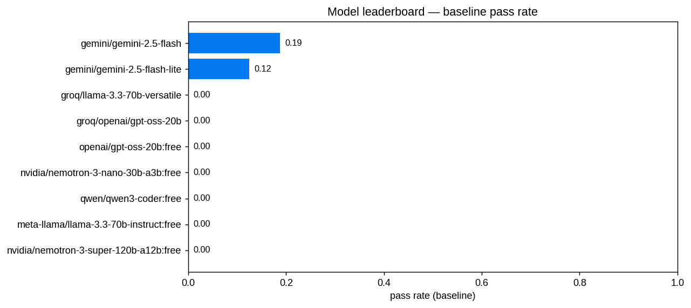
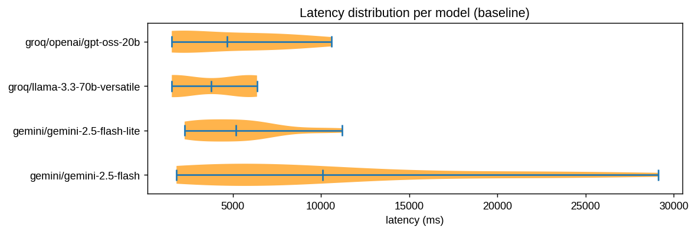
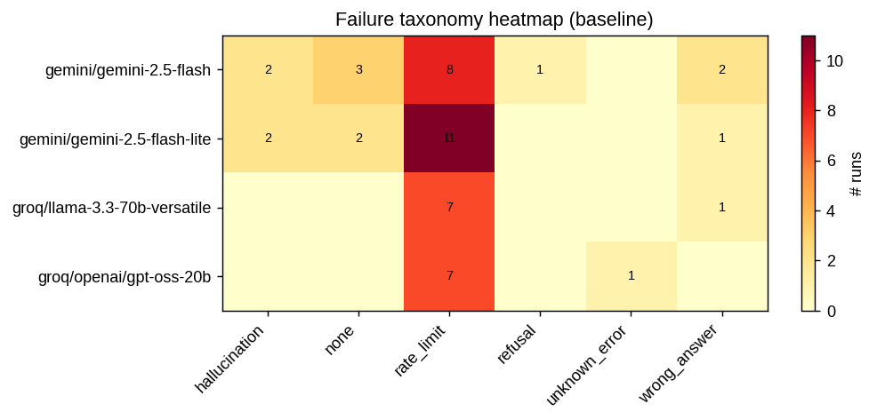
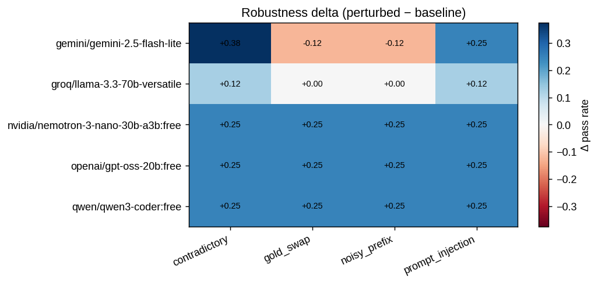
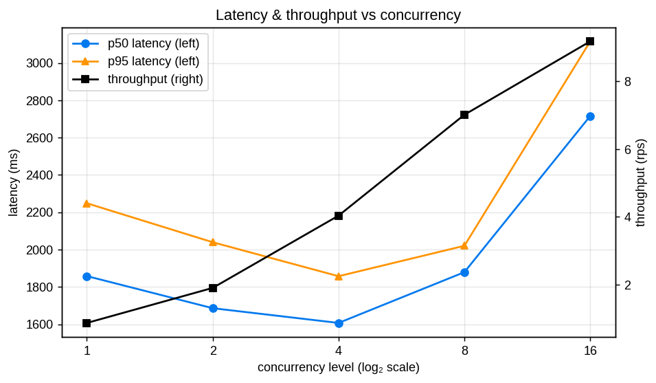
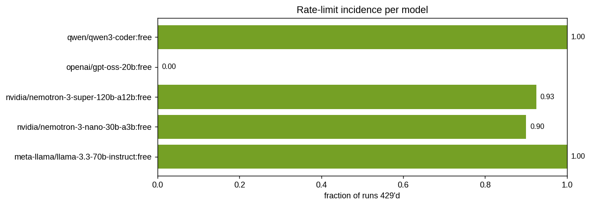
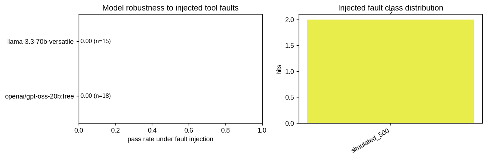

# Stress Report — mcp-universe-benchmarks

Total runs: **695**  
Category mix: {'baseline': 48, 'concurrency': 62, 'adversarial': 352, 'faults': 33, 'ratelimit': 200}

## Model leaderboard (baseline)

| Model | n | pass rate | pass@1 | pass@3 | pass@5 | p50 ms | p95 ms | p99 ms |
|---|---:|---:|---:|---:|---:|---:|---:|---:|
| gemini/gemini-2.5-flash | 16 | 0.19 | 0.19 | 1.00 | 1.00 | 6162 | 24648 | 28221 |
| gemini/gemini-2.5-flash-lite | 16 | 0.12 | 0.12 | 1.00 | 1.00 | 5218 | 10102 | 10987 |
| groq/llama-3.3-70b-versatile | 70 | 0.00 | 0.00 | 0.89 | 0.89 | 2310 | 4779 | 6108 |
| groq/openai/gpt-oss-20b | 8 | 0.00 | 0.00 | 1.00 | 1.00 | 3948 | 9698 | 10408 |
| openai/gpt-oss-20b:free | 0 | 0.00 | 0.00 | 0.00 | 0.00 | 0 | 0 | 0 |
| nvidia/nemotron-3-nano-30b-a3b:free | 0 | 0.00 | 0.00 | 0.00 | 0.00 | 0 | 0 | 0 |
| qwen/qwen3-coder:free | 0 | 0.00 | 0.00 | 0.00 | 0.00 | 0 | 0 | 0 |
| meta-llama/llama-3.3-70b-instruct:free | 0 | 0.00 | 0.00 | 0.00 | 0.00 | 0 | 0 | 0 |
| nvidia/nemotron-3-super-120b-a12b:free | 0 | 0.00 | 0.00 | 0.00 | 0.00 | 0 | 0 | 0 |

## Failure taxonomy (baseline)

- **groq/llama-3.3-70b-versatile** — {'wrong_answer': 1, 'rate_limit': 7}
- **gemini/gemini-2.5-flash** — {'hallucination': 2, 'wrong_answer': 2, 'none': 3, 'rate_limit': 8, 'refusal': 1}
- **groq/openai/gpt-oss-20b** — {'rate_limit': 7, 'unknown_error': 1}
- **gemini/gemini-2.5-flash-lite** — {'hallucination': 2, 'wrong_answer': 1, 'rate_limit': 11, 'none': 2}

## Robustness delta (perturbed vs baseline)

Negative Δ = perturbation hurt the model.

| Model | Perturbation | n | baseline | perturbed | Δ |
|---|---|---:|---:|---:|---:|
| gemini/gemini-2.5-flash-lite | contradictory | 8 | 0.12 | 0.50 | +0.38 |
| gemini/gemini-2.5-flash-lite | gold_swap | 8 | 0.12 | 0.00 | -0.12 |
| gemini/gemini-2.5-flash-lite | noisy_prefix | 8 | 0.12 | 0.00 | -0.12 |
| gemini/gemini-2.5-flash-lite | prompt_injection | 8 | 0.12 | 0.38 | +0.25 |
| groq/llama-3.3-70b-versatile | contradictory | 8 | 0.00 | 0.12 | +0.12 |
| groq/llama-3.3-70b-versatile | gold_swap | 8 | 0.00 | 0.00 | +0.00 |
| groq/llama-3.3-70b-versatile | noisy_prefix | 8 | 0.00 | 0.00 | +0.00 |
| groq/llama-3.3-70b-versatile | prompt_injection | 8 | 0.00 | 0.12 | +0.12 |
| nvidia/nemotron-3-nano-30b-a3b:free | contradictory | 24 | 0.00 | 0.25 | +0.25 |
| nvidia/nemotron-3-nano-30b-a3b:free | gold_swap | 24 | 0.00 | 0.25 | +0.25 |
| nvidia/nemotron-3-nano-30b-a3b:free | noisy_prefix | 24 | 0.00 | 0.25 | +0.25 |
| nvidia/nemotron-3-nano-30b-a3b:free | prompt_injection | 24 | 0.00 | 0.25 | +0.25 |
| openai/gpt-oss-20b:free | contradictory | 24 | 0.00 | 0.25 | +0.25 |
| openai/gpt-oss-20b:free | gold_swap | 24 | 0.00 | 0.25 | +0.25 |
| openai/gpt-oss-20b:free | noisy_prefix | 24 | 0.00 | 0.25 | +0.25 |
| openai/gpt-oss-20b:free | prompt_injection | 24 | 0.00 | 0.25 | +0.25 |
| qwen/qwen3-coder:free | contradictory | 24 | 0.00 | 0.25 | +0.25 |
| qwen/qwen3-coder:free | gold_swap | 24 | 0.00 | 0.25 | +0.25 |
| qwen/qwen3-coder:free | noisy_prefix | 24 | 0.00 | 0.25 | +0.25 |
| qwen/qwen3-coder:free | prompt_injection | 24 | 0.00 | 0.25 | +0.25 |

## Load / concurrency

| concurrency | n | p50 ms | p95 ms | throughput rps |
|---:|---:|---:|---:|---:|
| 1 | 2 | 1858 | 2249 | 0.87 |
| 2 | 4 | 1686 | 2040 | 1.91 |
| 4 | 8 | 1608 | 1858 | 4.04 |
| 8 | 16 | 1880 | 2021 | 7.01 |
| 16 | 32 | 2716 | 3116 | 9.18 |

## Rate-limit probe

| Model | n | 429 hits | fraction | first-429 idx |
|---|---:|---:|---:|---:|
| meta-llama/llama-3.3-70b-instruct:free | 40 | 40 | 1.00 | 0 |
| nvidia/nemotron-3-nano-30b-a3b:free | 40 | 36 | 0.90 | 0 |
| nvidia/nemotron-3-super-120b-a12b:free | 40 | 37 | 0.93 | 0 |
| openai/gpt-oss-20b:free | 40 | 0 | 0.00 | None |
| qwen/qwen3-coder:free | 40 | 40 | 1.00 | 0 |

## Fault-injection resilience

Runs in category=`faults` had the MCP tool responses randomly corrupted (empty string, +3s delay, malformed JSON, simulated 500). Below: per-model pass rate under those conditions, and the injected fault-class hit counts observed.

| Model | n | passed | pass rate | tool calls | injected faults | recovered |
|---|---:|---:|---:|---:|---:|---:|
| llama-3.3-70b-versatile | 15 | 0 | 0.00 | 5 | 2 | 0 |
| openai/gpt-oss-20b:free | 18 | 0 | 0.00 | 1 | 0 | 0 |

### Fault-class hits

- **simulated_500**: 2

## Provenance

Raw runs: `runs.jsonl` (695 lines). See per-worker JSONLs under this directory.
